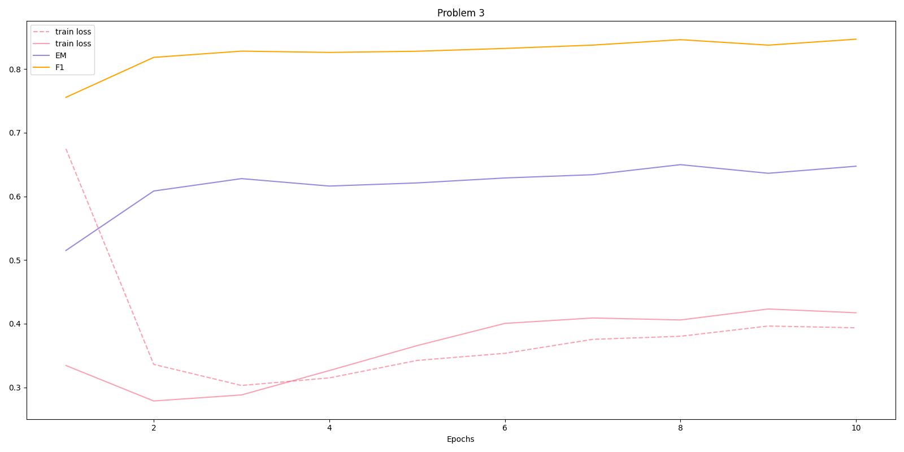

# Applied Deep Learning - Homework 2

###### Written By: Wu-Jun Pei (B06902029)

> (1) This document is edited with Typora. In case some markdown extensions (e.g. math mode) are not supported by native markdown editor, you can read [report.pdf](./report.pdf) for better reading experience.
>
> (2) Due to my improper time arrangement, I started to work on the homework late. After I finished the coding part, I was not able to tune / improve my model to pass the simple baseline.

### Q1: Data Preprocessing

#### <u>(a) Tokenizer</u>

The tokenizer for `bert-base-chinese` (and almost every chinese BERT model) is character-based. That is, a chinese character is considered as a token. However, some non-chinese character are still tokenized at a vocabulary-level, (e.g. some numbers, english words). For example, `你好啊！` will be tokenized into `['你', '好', '啊', '！']`, while `314159 tokenization` will be tokenized into `['314', '##15', '##9', 'to', '##ken', '##i', '##za', '##tion']`.

#### <u>(b) Answer Span</u>

To answer the questions, I'm going to explain my preprocessing procedure first.

1. Tokenize the question: Use the tokenizer to tokenize the question text into $Q$.
2. Tokenize the paragraph: Since the paragraph may be too long for the BERT model, I splitted the original paragraph into fragments by chinese dot `。`, and merge the fragments such that any fragment cannot be longer. Therefore, the number of fragments is minimized. For each fragment, we derive its tokens $F$ in the following two ways.
    1. If the fragment does not contain answer span, we directly tokenize the fragment. *Note: this kind of fragment will not be used in the question answering task*
    2. Otherwise, we specially handle this case. The fragment can be splitted into `(before, answer span, after)`, and we tokenize each sub-fragment and concatenate them together. By doing this, we can explicitly know the start/end position of the answer span from the token level.
3. Construct a data sample: Finally, we can have a data sample
    - input token: `[CLS] + Q + [SEP] + F + [SEP]`
    - `has_answer`: determines whether the fragment has answer as in step 2
    - start/end position (for those whose `has_answer` is True): can be derived in step 2-2

Thus, 

1. The start/end position can be derived by calculating the offsets before the answer span, as explained in step 2-2.
2. Since the tokens are passed into the model as well, we can directly take the tokens and reconstruct the answer text.

### Q2: Modeling with BERT and their variants

Following the guides on the homework slides, I split the task into two subtasks, (1) context selection and (2) question answering. The two models are trained seperately.

#### <u>(a) Describe your model</u>

1. Model
    - The backbone model is set to `bert-base-chinese` as suggested on the homework slide.
    - For context selection model, we apply an additional Linear layer to take the BERT's pooler output $\text{BERT}_{\text{pooler_output}}$ as input and predicts a single score $s_\text{context}$ as output, representing how likely the question is relevant to the given fragment. Technically speacking, 
    - For question answering model, we apply an additional Linear layer to take the each of BERT's last hidden output $\text{BERT}_{\text{last_hidden}}$ as input and predicts two scores $s_\text{start}$, $s_{end}$ as output, representing how likely the token is the start/end index for answer span.
2. Performance
    - Context selection (validation set)
        - Accuracy (binary classification): <u>0.94359</u>
    - Question answering (validation set)
        - EM: <u>0.64979</u>
        - F1: <u>0.84613</u>
    - Overall (public set)
        - EM: <u>0.62762</u>
        - F1: <u>0.69477</u>
3. Loss function
    1. For context selection, I regard the task as a <u>binary classification</u> -- predicting whether a *fragment* has answer span in it. Thus, the loss function I use is a standard <u>binary cross entropy loss</u>.
    2. For question answering, I regard the task as a <u>span selection</u> -- predicting two 512-class indices representing the start/end index. Therefore, the loss function I use is a standard <u>cross entropy loss</u>.
4. Optimizer: Adam with learning rate <u>1e-5</u>, weight decay <u>5e-6</u> and *effective* batch size <u>32</u>. The *effective* batch size is the real batch size (<u>4</u>, limited by the GPU) times gradient accumulation steps (<u>8</u>). The model is trained for <u>10</u> epochs, the checkpoint with the highest validation accuracy will be used.

#### <u>(b) Another type of pretrained model</u>

Besides `bert-base-chinese`, I also tried another pretrained model, MacBert. It's publicly available on transformers's model page.

1. Model

    Only the backbone bert model is changed to `hfl/chinese-macbert-base`. Other parts are the same.

2. Performance

    - Context selection (validation set)
        - Accuracy (binary classification): <u>0.96472</u>
    - Question answering (validation set)
        - EM: <u>0.71127</u>
        - F1: <u>0.88021</u>
    - Overall (public set)
        - EM: <u>0.66222</u>
        - F1: <u>0.73890</u>

3. Difference between the pretrained model

    The MacBert is actually an improved BERT. In constract to the original MLM pretraining task, MacBERT is trained with a novel MLM as correct pretraining task. The authors proposed to use similar words for the masking purpose. Reference: [MacBert's GitHub](https://github.com/ymcui/MacBERT).

### Q3: Curves

> (1) Based on the discussion on the forum, I only consider the question answering task. The data used is the validation set.
>
> (2) I plot the two curves in the same graph.

### Q4: Pretrained v.s. Not Pretrained

> I didn't train a non-pretrained version.

### Q5: Bonus - HW1 with BERTs

I also tried to apply BERT in my homework 1. Generally speaking, the model is exactly the same as the one I implement in HW1, except I changed the RNN module to BERT.

#### <u>(a) Model Architecture</u>

1. The bert model I use is `bert-base-uncased`. And the tokenizer, of course, is inherited from `bert-base-uncased`.
2. Two customized fully-connected heads are used for each task. The input dimension is the hidden dimension of the bert model, which is 768 for `bert-base-uncased`. The output dimension is related to the output domain, 150 for intent classification and 9 for slot tagging.
3. The model flow is the same as it in Hoemwork 1.

#### <u>(b) Performance</u>

- Intent classification

    | Model | Validation Acc. | Public Score | Private Score |
    | ----- | ------------------ | --------------- | ---------------- |
    | RNN   | 0.9037             | 0.90000         | 0.89733          |
    | BERT  | 0.964              | 0.95600         | 0.96177          |

- Slot tagging

    | Model | Validation Token Acc. | Validation Joint Acc. | Public Score | Private Score |
    | ----- | ------------------------ | ------------------------ | --------------- | ---------------- |
    | RNN   | 0.96369                  | 0.77990                  | 0.78498         | 0.79635          |
    | BERT  | 0.968                    | 0.806                    | 0.80697         | 0.79421          |

#### <u>(c) Loss Function</u>

Same as Homework 1, I use the standard [cross entropy loss](https://pytorch.org/docs/stable/generated/torch.nn.CrossEntropyLoss.html) as the loss function in both tasks.

#### <u>(d) Optimizer</u>

I use the same optimizer settings in the two tasks for training the BERT model.

- Optimizer: [Adam](https://pytorch.org/docs/stable/optim.html#torch.optim.Adam) with learning rate=<u>2e-5</u> and weight_decay=<u>1e-5</u>
- Batch size: <u>64</u>
- Trained for <u>50</u> epochs, the checkpoints at the <u>15</u> epoch are selected by their validation loss.

